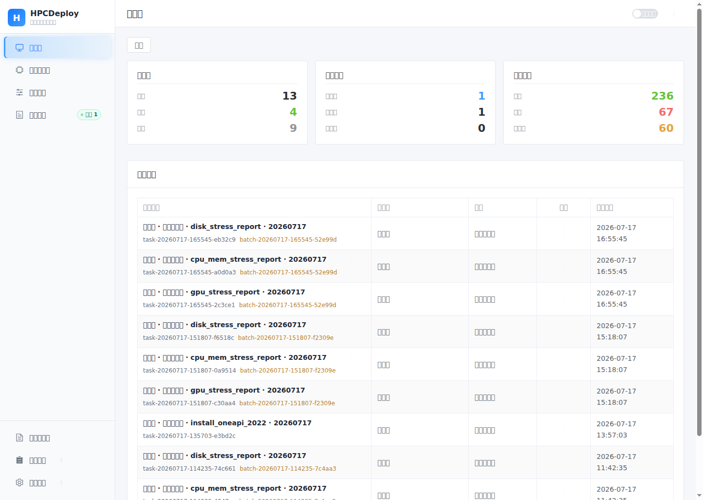

# HPCDeploy

> 面向 Linux / HPC 运维场景的轻量级自动化控制台：统一管理服务器、受控脚本、压测任务、Apptainer 镜像、运行日志、结果文件与审计操作。

HPCDeploy 通过 SSH 在远端执行白名单脚本，提供批量任务调度、实时日志与资源监控，以及 GPU、CPU/内存、磁盘压测报告的回收与追踪。

## 界面预览



> 截图来自 2026-07-17 的运行实例。页面集中展示服务器在线状态、任务执行状态、归档结果统计与最近任务，便于运维人员快速进入目标操作。

## 快速了解

| 项目 | 当前状态 |
|---|---|
| 版本定位 | v1.02 Linux 维护版 |
| 被管对象 | Linux / HPC 服务器 |
| 执行方式 | SSH 下发并执行受控脚本 |
| 压测能力 | GPU、CPU/内存、磁盘压测与报告回收 |
| 当前部署 | systemd（后端 uvicorn + 前端 Vite dev server） |
| 数据存储 | SQLite |
| 暂不支持 | Windows Server、Docker / Compose 容器化、Nginx 静态托管生产形态 |

## 核心能力

| 能力域 | 提供内容 |
|---|---|
| 服务器接入 | SSH 探测、密码/密钥认证、公钥部署、标签管理与在线状态复检 |
| 自动化执行 | 白名单脚本库、单台/批量任务、同服务器压测套件严格串行调度 |
| 压测与结果 | GPU、CPU/内存、磁盘压测；回收 `.log`、`.txt`、`.csv`、`.xlsx`、`.json` |
| 可观测与恢复 | WebSocket 实时日志、CPU/内存/磁盘/GPU 监控、任务诊断与后端重启后恢复监控 |
| 资产与治理 | Apptainer `.sif` 分发、任务历史与失败重跑、管理员模式、审计与自动清理 |

## 快速启动

### 前提

- 部署机：Linux，具备 `sudo` 权限及网络访问所需的软件源。
- 被管服务器：SSH 可达，使用有效的密码或私钥认证；GPU 压测目标需具备可用的 NVIDIA 驱动与 `nvidia-smi`。
- 网络：安装后前端监听 `0.0.0.0:5173`，后端监听 `127.0.0.1:8000`。

### 首次部署

```bash
git clone <repo-url> hpc-deploy
cd hpc-deploy
sudo deploy/scripts/install_hpcdeploy_service.sh
```

安装完成后访问：`http://<server-ip>:5173`

安装脚本会安装基础依赖、创建后端虚拟环境、安装前端依赖、初始化运行目录，并注册和启动两个 systemd 服务。部署详情与日常更新见 [deploy/README.md](deploy/README.md)。

## 使用流程

1. 在“服务器管理”新增目标服务器并完成 SSH 探测。
2. 在“脚本知识库”维护受控脚本，或上传待分发的 Apptainer `.sif` 镜像。
3. 在“执行任务”选择服务器与脚本，实时查看日志、资源指标和任务状态。
4. 在“历史任务”查看批次、诊断失败原因、下载或回收结果文件；管理员可执行清理和审计查询。

## 目录

- [技术栈](#技术栈)
- [权限模型](#权限模型)
- [开发与运维命令](#开发与运维命令)
- [构建验证](#构建验证)
- [关键目录与运行数据](#关键目录与运行数据)
- [安全边界](#安全边界)
- [文档导航](#文档导航)

## 技术栈

| 模块 | 技术 |
|------|------|
| 前端框架 | Vue 3 + Vite |
| 前端 UI | Element Plus |
| 前端路由 | Vue Router |
| 后端框架 | FastAPI |
| ORM | SQLAlchemy |
| 数据库 | SQLite |
| SSH 执行 | Paramiko |
| 实时日志 | WebSocket + HTTP 双通道 |

## 权限模型

- **普通模式默认可用** — 可新增/编辑服务器、SSH 检测、部署公钥、提交任务、取消任务、查看历史/日志/结果；上传脚本保留一次管理员密码确认。
- **管理员模式处理高风险操作** — 删除服务器/脚本/任务/批次任务、系统设置写入与本机结果清理。管理员模式可选 5 / 15 / 30 / 60 分钟或本标签页持续。
- **会话恢复** — 管理员 JWT 存在 HttpOnly Cookie 中并绑定当前标签页；刷新页面可恢复有效会话，手动退出、超时或关闭标签页后会清除管理员权限。
- **审计日志** — 普通模式不能进入；管理员模式进入后直接加载，无需再次输入密码。

## 开发与运维命令

### 开发模式（热重载）

```bash
# 后端
cd /path/to/hpc-deploy/backend
PYTHONPATH=.deps:. .deps/bin/uvicorn main:app --reload --host 0.0.0.0 --port 8000

# 前端
cd /path/to/hpc-deploy/frontend
npm run dev
```

### 当前 systemd 开发服务

```bash
# 重启后端
sudo systemctl restart hpcdeploy-backend

# 重启前端 Vite dev server
sudo systemctl restart hpcdeploy-frontend

# 更新依赖并重启两个服务
sudo deploy/scripts/redeploy_hpcdeploy.sh

# 查看状态
sudo systemctl status hpcdeploy-backend --no-pager -l
sudo systemctl status hpcdeploy-frontend --no-pager -l
```

> 前端服务运行 `npm run dev -- --host 0.0.0.0 --port 5173`，支持 Vite HMR。访问地址默认为 `http://<server-ip>:5173`。

## 构建验证

```bash
# 后端编译检查
python3 -m compileall backend/app backend/main.py

# 前端 TypeScript + 构建
cd frontend && npm run build
```

## 关键目录与运行数据

### 本地项目关键目录

| 路径 | 用途 | 是否进入 Git |
|------|------|--------------|
| `backend/app/api/` | FastAPI API 路由层，处理服务器、任务、设置、清理、审计等接口 | 是 |
| `backend/app/core/` | 后端核心逻辑，包含 SSH 执行、任务调度、报告回收、诊断、恢复、批次导出 | 是 |
| `backend/app/models/` | SQLAlchemy 数据库模型 | 是 |
| `backend/app/schemas/` | Pydantic 请求/响应结构 | 是 |
| `backend/scripts/mpi/` | 编译环境/安装类白名单脚本库 | 是 |
| `backend/scripts/stress/` | GPU / CPU内存 / Disk 压测脚本库 | 是 |
| `backend/apptainer/` | Apptainer `.sif` 镜像存放目录 | 目录保留，`.sif` 不进 Git |
| `backend/keys/` | SSH 私钥/公钥存放目录 | 目录保留，密钥不进 Git |
| `backend/data/` | SQLite 数据库、任务结果、运行数据 | 不进 Git |
| `backend/data/artifacts/` | 后端从远端回收的报告、日志、CSV、XLSX 等结果文件 | 不进 Git |
| `frontend/src/views/` | 前端页面 | 是 |
| `frontend/src/components/` | 前端复用组件 | 是 |
| `frontend/src/api/` | 前端 API client | 是 |
| `frontend/dist/` | 前端构建产物，由 `npm run build` 生成 | 不进 Git |
| `deploy/` | systemd、nginx、部署脚本 | 是 |

### 数据库

当前使用 **SQLite**。

默认数据库文件：

```text
backend/data/hpc_control_panel.db
```

配置来源：

```text
backend/app/core/config.py
DATABASE_URL=sqlite:///./data/hpc_control_panel.db
```

数据库里保存：

- 服务器列表、SSH 登录方式、服务器状态、探测结果
- 任务、批次、任务日志、任务状态
- 系统设置、默认 SSH key 文件名
- 审计日志
- 报告 summary cache

数据库文件不进入 Git，原因：

- 属于运行状态，不是源码
- 可能包含服务器地址、账号、密码/配置痕迹、任务历史
- 不适合随代码仓库同步

新机器拉代码后，如果不拷贝数据库，后端首次启动会自动创建空库和表结构。

完整迁移已有环境时，需要额外拷贝：

```bash
backend/data/hpc_control_panel.db
backend/data/artifacts/
backend/keys/
backend/apptainer/*.sif
```

### SSH 密钥

SSH 密钥目录：

```text
backend/keys/
```

规则：

- Git 只保留 `backend/keys/.gitkeep`
- 实际密钥文件如 `id_ed25519`、`id_ed25519.pub` 不进入 Git
- 系统只保存默认密钥文件名，不保存密钥内容；默认密钥生成入口在服务器管理的“部署公钥”流程中
- API 不返回私钥/公钥内容

### 脚本与镜像

脚本库：

```text
backend/scripts/mpi/
backend/scripts/stress/
```

这些脚本属于代码/白名单资产，会进入 Git。

Apptainer 镜像目录：

```text
backend/apptainer/
```

`.sif` 镜像不进入 Git，原因是镜像通常较大，且属于运行资产，不适合作为源码提交。

### 任务执行时会推送到远端服务器的内容

HPCDeploy 不会把整个项目目录推到目标 HPC 服务器。

任务执行时只上传“当前任务选择的单个库文件”：

- 编译环境/普通脚本：上传选中的 `backend/scripts/mpi/*`
- 压测任务：上传选中的 `backend/scripts/stress/*`
- Apptainer 分发：上传选中的 `backend/apptainer/*.sif`

远端目录：

```text
$HOME/hpcdeploy/tasks/<task_type>/<脚本名_时间>/
$HOME/hpcdeploy/apptainer/
```

压测任务在远端目录内生成：

- `task.log`
- `.hpcdeploy.pid`
- `*report*.xlsx`
- `*report*.txt`
- 相关 `.csv` / `.log` / `.json`

后端任务结束后，会把允许的结果文件回收到：

```text
backend/data/artifacts/
```

### 不进入 Git 的关键文件

由 `.gitignore` 控制，主要包括：

```text
backend/.deps/
frontend/node_modules/
frontend/dist/
frontend/tsconfig.tsbuildinfo
.env
.env.local
*.db
*.sqlite
*.sqlite3
backend/data/artifacts/
backend/keys/*
backend/apptainer/*.sif
*.log
```

这些文件不推送的原因：

- 依赖目录和构建产物可重新生成
- 数据库、artifacts、日志是运行数据
- SSH keys、`.env` 是敏感信息
- `.sif` 是大体积运行资产

### 环境变量

后端支持的主要环境变量：

| 变量 | 默认值 | 说明 |
|------|--------|------|
| `APP_NAME` | `HPCDeploy` | 应用名称 |
| `APP_ENV` | `development` | 运行环境 |
| `DATABASE_URL` | `sqlite:///./data/hpc_control_panel.db` | 数据库连接，后端工作目录下解析为 `backend/data/hpc_control_panel.db` |
| `SECRET_KEY` | `dev-secret-key-change-in-production` | JWT 签名密钥，生产环境必须修改 |
| `ACCESS_TOKEN_EXPIRE_MINUTES` | `480` | 登录/管理 token 过期时间 |
| `HPCDEPLOY_ADMIN_PASSWORD` | `admin123` | 管理员密码环境变量 fallback |

当前 systemd 服务显式设置：

```text
PYTHONPATH=/home/tjzs/projects/hpc-deploy/backend/.deps:/home/tjzs/projects/hpc-deploy/backend
```

配置文件：

```text
deploy/systemd/hpcdeploy-backend.service
```

## 安全边界

- 前端不传 `command` / `raw shell` / `remote_path` / `raw_args`
- 前端不传 `remote_work_dir` — 远端工作目录由后端 `UUID` 生成，不绕过 `task_runner`
- 后端只执行白名单脚本（文件名白名单 + 目录校验）
- Apptainer 只上传/分发 `.sif`，不执行 `run` / `exec`
- SSH 私钥只保存文件名，不保存内容；API 不返回私钥/公钥内容
- 远端清理只允许 `tasks` / `downloads` / `tmp`，不清理 `$HOME/hpcdeploy/apptainer`
- 自动清理以任务结束时间（无结束时间时创建时间）判断保留期，同步清理 `backend/data/artifacts/<task_id>/` 与同任务 `task_logs`；不清理任务记录、远端目录、Apptainer 镜像、keys、scripts
- 路径防逃逸（`resolve()` + `startswith()`）
- 取消任务基于 PID 文件 + PGID 进程组终止，不依赖前端输入
- 部署公钥只写远端 `$HOME/.ssh/authorized_keys`，不覆盖、不修改 `sshd_config`、不重启 `sshd`
- 部署公钥按每台服务器自身 `auth_type` 独立认证登录，不固定同一私钥
- 密钥路径统一解析为 `KEYS_DIR` 下绝对路径，防止相对路径/CWD 问题
- 管理员密码通过 `HPCDEPLOY_ADMIN_PASSWORD` 环境变量设置，不返回前端、不打印日志
- 高风险接口通过可选时长或本标签页持续的 JWT 保护；浏览器以 HttpOnly Cookie 和标签页标识共同校验，关闭标签页后不能复用管理员权限

## 文档导航

按当前任务选择对应文档，避免在维护记录中查找操作步骤：

| 如果你要…… | 阅读文档 | 内容 |
|---|---|---|
| 首次安装、日常更新或排查 systemd 服务 | [deploy/README.md](deploy/README.md) | 可执行安装、更新、状态与日志命令 |
| 备份/恢复 SQLite，评估 Docker 或 MySQL 路线 | [docs/deployment.md](docs/deployment.md) | 数据运维与部署演进，不重复安装步骤 |
| 修改 API、SSH、任务调度、数据模型或安全策略 | [docs/architecture.md](docs/architecture.md) | 当前架构、接口职责、状态机与安全模型 |
| 了解当前已交付能力、维护记录与下一步入口 | [docs/progress.md](docs/progress.md) | 维护流水，不作为当前行为的唯一依据 |
| 查询历史阶段范围与不可突破的约束 | [docs/development-stages.md](docs/development-stages.md) | 阶段交付归档 |
| 修改煤球、趣味文案或相关前端交互 | [docs/fun-principles.md](docs/fun-principles.md) | 趣味性设计约束与实现位置 |
