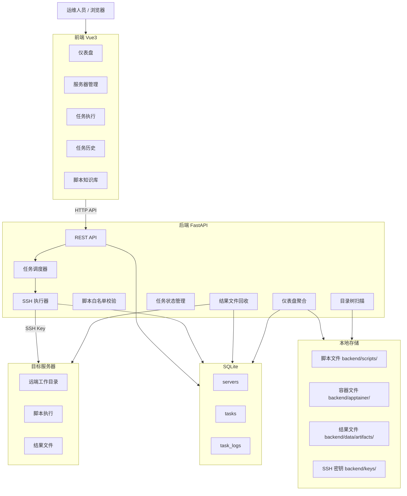
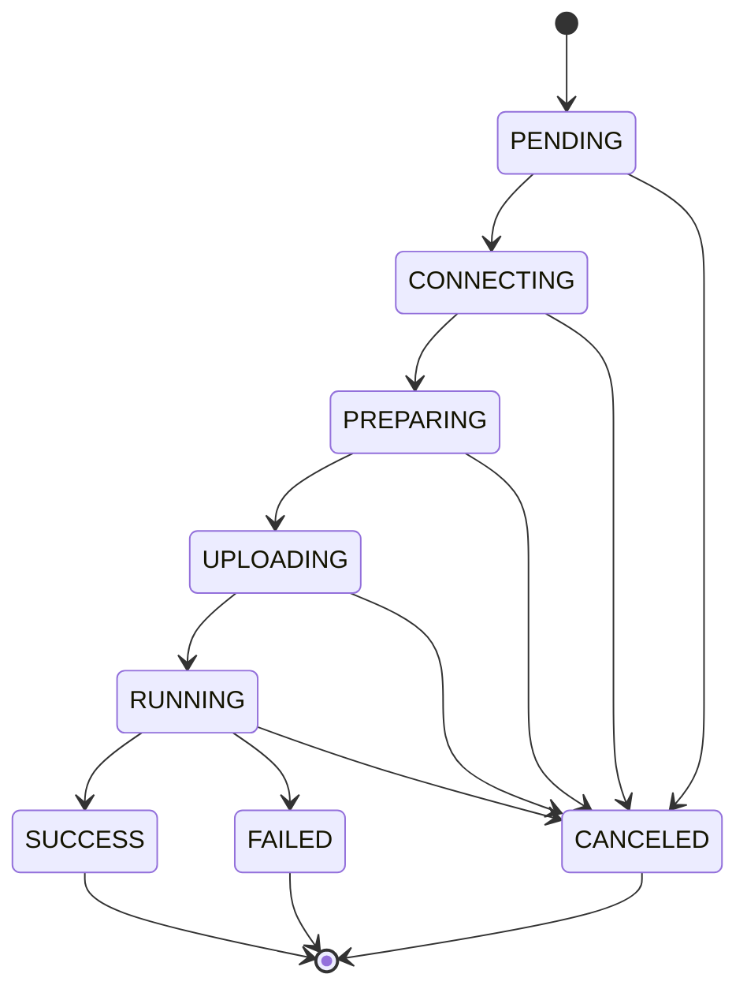

# HPCDeploy 系统架构说明

> 本文档描述 HPCDeploy 当前实际系统架构，非设计阶段草案。

---

## 1. 系统定位

HPCDeploy 是一个面向 HPC 运维的轻量级脚本执行控制台。核心能力：

- 通过 Web 页面管理目标服务器
- 维护脚本知识库（四类固定目录）
- SSH/SFTP 远程执行白名单脚本
- 实时日志（WebSocket + HTTP 轮询双通道）
- 结构化资源快照（CPU/内存/磁盘/GPU 卡片，5s 轮询）
- 任务历史与结果文件回收
- 任务取消（PID→PGID 进程组终止 + 目录清理）
- 任务删除（清理 artifacts / 远端目录 / 日志 / 记录）
- 仪表盘数据化总览（服务器 / 任务 / 归档统计）
- 结果文件归档目录树查看
- Password 登录后部署公钥并切换为 SSH Key
- 服务器健康状态增强（状态 / 最后探测 / 最后错误 / 资源摘要）
- AI 任务日志诊断（匹配失败模式，给出原因与建议）
- 任务进度可视化（中文状态标签 / 运行耗时 / 进度条 / 预计剩余）

---

## 2. 技术栈

| 模块 | 技术 | 说明 |
|------|------|------|
| 前端框架 | Vue 3 + Vite | 后台管理控制台 |
| 前端 UI | Element Plus | 表格、表单、卡片、弹窗、树组件 |
| 前端请求 | Axios | REST API 调用 |
| 前端状态管理 | Pinia | 服务器/任务/日志状态 |
| 前端路由 | Vue Router | 页面路由 |
| 后端框架 | FastAPI | REST API |
| 后端运行 | Uvicorn | ASGI 服务 |
| ORM | SQLAlchemy | 数据库 ORM |
| 数据校验 | Pydantic | 请求/响应校验 |
| 数据库 | SQLite | 单文件数据库 |
| SSH 执行 | Paramiko | SSH Key / Password 认证 + SFTP |
| 任务队列 | asyncio 内存协程 | 无持久化队列 |
| 部署方式 | systemd 服务 | 前后端独立服务 |

---

## 3. 总体架构



---

## 4. 核心模块

### 4.1 脚本知识库 (`backend/app/core/script_library.py`)

四类固定目录，由后端文件系统扫描驱动，不依赖数据库 scripts 表：

| 分类 | 目录 | 文件类型 | 执行行为 |
|------|------|----------|----------|
| 编译环境 | `backend/scripts/mpi/` | `.sh` | 白名单脚本执行 |
| 压测脚本 | `backend/scripts/stress/` | `.sh` | 直接执行，带时长参数 |
| 测试脚本 | `backend/scripts/test/` | `.sh` | 直接执行 |
| 容器文件 | `backend/apptainer/` | `.sif` | 仅上传分发，不执行 |

### 4.2 任务类型

| 类型 | 执行命令 | 远程目录 | 结果回收 |
|------|----------|----------|----------|
| test | `bash ./script.sh` | `~/hpcdeploy/tasks/test/{id}/` | 否 |
| stress | `./script.sh duration_seconds` | `~/hpcdeploy/tasks/stress/{id}/` | 是 |
| mpi | `bash ./script.sh` | `~/hpcdeploy/tasks/mpi/{id}/` | 否 |
| apptainer | SFTP 上传 `.sif` | `$HOME/hpcdeploy/apptainer/` | 否 |

### 4.3 服务器接入

- 支持 `SSH Key` 和 `Password` 两种认证方式
- `backend/keys/` 保存本地私钥和同名 `.pub` 公钥
- `GET /api/ssh-keys` 只返回密钥元信息：
  - `key_name`
  - `private_key_name`
  - `public_key_name`
  - `private_key_path`
  - `has_public_key`
  - `display_name`
- 部署公钥流程：
  1. 使用服务器已保存的账号密码登录远端
  2. 读取本地私钥对应 `.pub`
  3. 只向远端 `~/.ssh/authorized_keys` 追加公钥
  4. 不上传私钥
  5. 成功后服务器认证方式切换为 `SSH Key`

### 4.4 MPI 脚本白名单

`backend/scripts/mpi/` 下当前开放执行的脚本：

- `mpi_env_test.sh` — 环境检测
- `install_oneapi_2022.sh` — Intel OneAPI 安装
- `install_openmpi_4.1.6_aocc_aocl.sh` — OpenMPI 编译安装

### 4.5 任务状态机

状态流转：



终态：SUCCESS、FAILED、CANCELED。仅终态允许删除。

---

## 5. 仪表盘模块

### 5.1 Dashboard Summary API

`GET /api/dashboard/summary` → `DashboardSummary`

返回四组聚合数据：
- **servers**：总数、在线数、离线数（查询 servers 表）
- **tasks**：按状态分类计数（运行中/等待中/取消中/成功/失败/已取消）
- **recent_tasks**：最近 10 条任务（含服务名关联）
- **artifacts**：目录数量和总占用空间（扫描 backend/data/artifacts/）

只读聚合查询，不修改数据。

服务器在线/离线统计以 `servers.status` 为准：
- `online = status == online`
- `offline = total - online`
- `unknown / null` 当前计入 offline

### 5.2 Artifact Tree API

`GET /api/dashboard/artifacts/tree?max_depth=2&limit=200` → `ArtifactTreeResponse`

- 递归扫描 `backend/data/artifacts/` 下子目录
- 按目录大小降序排列
- max_depth 限制展示深度（1-5）
- limit 限制最大目录数（默认 200）
- 超出 limit 时设置 truncated=true
- 只读，不删除文件

---

## 6. 远程目录设计

### 6.1 工作目录

```
~/hpcdeploy/tasks/{task_type}/{task_id}/
```

- apptainer 使用独立目录：`$HOME/hpcdeploy/apptainer/`

### 6.2 文件权限

- `.sh` / `.py` 上传后 `chmod +x` → `-rwxr-xr-x`
- `.sif` 不上传可执行权限

### 6.3 结果文件回收目录

```
backend/data/artifacts/{task_id}/
```

允许回收的后缀：`.log`、`.txt`、`.csv`、`.xlsx`、`.json`

### 6.4 本地目录约定

- `backend/scripts/test/`：测试脚本
- `backend/scripts/stress/`：压测脚本
- `backend/scripts/mpi/`：MPI / 编译环境脚本
- `backend/apptainer/`：`.sif` 文件管理目录
- `backend/keys/`：本地 SSH 私钥与同名 `.pub` 公钥
- `backend/data/artifacts/`：任务结果回收目录

说明：
- `backend/keys/` 中真实密钥不应提交到 Git
- `backend/apptainer/` 中大型 `.sif` 文件不应提交到 Git

---

## 7. 任务取消设计

### 7.1 进程模型

```bash
setsid --wait bash -lc 'printf "%s" $$ > .hpcdeploy.pid; exec <command>'
```

- `setsid` 创建新 session（pid == pgid）
- PID 写入 `.hpcdeploy.pid` 文件
- `exec` 后 bash PID 变为脚本 PID

### 7.2 取消流程

```
请求取消 → 读取 .hpcdeploy.pid → 获取 PGID
→ SIGTERM → 等待 5s → SIGKILL
→ 清理远端工作目录
→ 清理临时目录白名单
→ 状态 CANCELED, exit_code -15
```

### 7.3 安全模型

- 不许前端传 PID/路径/命令
- 临时目录白名单代码级硬编码
- 取消失败不改变 CANCELED 状态
- 不删除任务记录和日志
- 不回滚已安装软件

---

## 8. 任务删除设计

### 8.1 删除流程

```
删除请求 → 验证终态 → 删除本地 artifacts
→ SSH 连接 → 安全校验远端路径 → rm -rf 远端目录
→ 删除 task_logs → 删除 task 记录
```

### 8.2 安全模型

- **远端路径安全校验**：`_is_safe_remote_work_dir()` 要求路径包含 `hpcdeploy/tasks/{type}/{timestamp}` 格式，禁止 `/root`、`/home`、`/tmp`、`/opt`、`/usr`、`/etc`
- **本地路径防逃逸**：`resolve()` + `startswith()` 确保 artifact 目录在白名单内
- **事务安全**：SSH 失败或路径校验失败返回错误，不删数据库记录
- **不删除**：服务器配置、脚本文件、已安装软件、Apptainer 仓库

---

## 9. 当前安全边界

- 前端不传 `command`
- 前端不传 `remote_path`
- 前端不传 `local_path`
- 前端不传 `PID`
- 前端不传 `kill command`
- 后端只执行白名单脚本
- 服务器探测只执行固定安全命令
- 不允许任意远程命令执行
- 不删除 `/opt`
- 不删除 `/usr`
- 不删除 `/etc`
- 不删除 `/root`
- 不删除 `/home`
- 不删除 `/tmp` 整体目录
- 不删除 `$HOME/hpcdeploy/apptainer`
- 不执行 `apptainer run / exec`
- 不返回私钥内容
- 不返回公钥内容
- 部署公钥只写远端 `~/.ssh/authorized_keys`
- 不覆盖 `authorized_keys`
- 不修改 `sshd_config`
- 不重启 `sshd`
- 不对远端执行 `systemctl / reboot / shutdown`

---

## 9. 任务列表查询 API

`GET /api/tasks` 支持以下查询参数：

| 参数 | 类型 | 默认值 | 说明 |
|------|------|--------|------|
| `status` | string | 无 | 状态筛选（9 个合法值） |
| `task_type` | string | 无 | 类型筛选（test/stress/mpi/apptainer） |
| `server_id` | int | 无 | 按服务器 ID 筛选 |
| `keyword` | string | 无 | 关键词搜索（task_id/file_path/remote_work_dir/error_message） |
| `limit` | int | 50 | 每页数量，最大 100 |
| `offset` | int | 0 | 分页偏移 |
| `order` | string | `created_desc` | 排序方式 |

返回结构：`{ items: [...], total: number, limit: number, offset: number }`

安全要求：参数白名单校验 + 400 响应；keyword 参数化查询防 SQL 注入。

---

## 10. 安全边界

### 10.1 前端不可传入

- `command` → 命令由后端按任务类型固定生成
- `remote_path` → 路径由后端按规则计算
- `timeout` → 由后端根据任务类型计算
- PID/进程组信息 → 取消通过 PID 文件定位

### 10.2 结构化监控（Phase 24B）

`GET /api/tasks/{task_id}/monitor` → `TaskMonitorResponseStructured`

返回三段独立数据，子系统隔离（单个失败不影响其他）：

```json
{
  "task_id": "...",
  "status": "RUNNING",
  "sampled_at": "2026-06-22T10:00:00",
  "cpu_memory": {
    "available": true,
    "cpu_usage_percent": 35.2,
    "load_avg": "0.85 0.62 0.45",
    "memory_total": "31.2G",
    "memory_used": "8.5G",
    "memory_usage_percent": 27.2,
    "message": null
  },
  "disk": {
    "available": true,
    "disk_usage": [
      { "mount": "/", "total": "100G", "used": "45G", "available": "55G", "usage_percent": 45.0 }
    ],
    "message": null
  },
  "gpu": {
    "available": true,
    "items": [
      { "index": "0", "name": "NVIDIA A100", "utilization_gpu": "42", "memory_used": "16384", "memory_total": "40960", "temperature": "65" }
    ],
    "message": null
  }
}
```

安全约束：
- 所有命令后端硬编码，不接受前端参数
- SSH 连接失败 → 全部 section available=false
- 单个命令失败 → 该 section available=false + message 说明
- 5s 轮询，前端 `activeTaskId` + monitor tab 激活时才拉取

### 10.3 后端校验

- 脚本路径必须命中知识库目录
- 文件名校验（basename、禁止 ..、禁止 /）
- 文件路径 resolve() + startswith() 防逃逸
- 回收文件后缀白名单
- limit 上限 100 防止超量查询

### 10.3 远端安全

- 远端工作目录 `$HOME/hpcdeploy/` 下
- 删除任务时远端路径禁止 /root /home /tmp /opt /usr /etc
- 同服务器只允许一个未完成任务

---

## 11. 日志体系

### 11.1 日志层级

| Level | 来源 | 说明 |
|-------|------|------|
| SYSTEM | 后端生成 | 连接/上传/执行/状态变更/回收 |
| INFO | SSH stdout | 脚本正常输出 |
| ERROR | SSH stderr | 脚本错误输出 |

### 11.2 日志存储

- 每条日志写入 `task_logs` 表
- 时间戳存储为 UTC，前端 `formatDateTime()` 转换本地时间
- 显示格式：`YYYY/MM/DD HH:mm:ss`
- 实时查看：
  - 主通道：WebSocket `/ws/tasks/{task_id}`（心跳 30s）
  - 备用通道：HTTP 轮询 `GET /api/tasks/{id}/logs`（2s 间隔）
- 日志下载：`GET /api/tasks/{id}/logs/download` → text/plain

---

## 12. 关键设计决策

### 12.1 WebSocket 实时日志（Phase 23A）
WebSocket 端点为 `/ws/tasks/{task_id}`，通过 `ws_manager.py` 管理连接：
- 心跳间隔 30s，超时 60s 清理
- 消息格式：`{ "type": "log|status|done", "data": {...} }`
- 前端 `useTaskWebSocket` composable 管理生命周期
- HTTP 轮询作为备用通道，WS 断线自动切换

### 12.2 为什么不用 Server Lock？
简单的同服务器状态检查（查询是否存在未完成任务）即可满足 MVP 需求。

### 12.3 为什么用 `setsid --wait`？
确保整个进程组在一个 session 内（pid == pgid），支持通过 PGID 一次性终止所有子进程。

### 12.4 为什么不用 scripts 表做白名单？
当前通过文件系统扫描 + 代码级文件名白名单实现，无需数据库维护，部署更简单。

---

## 13. 前端布局架构

| 元素 | 定位 | 样式 |
|------|------|------|
| `.app-sidebar` | `position: fixed; left: 0; top: 0; bottom: 0` | `width: 236px; z-index: 30` |
| `.app-main-area` | `margin-left: 236px` | `height: 100vh; overflow-y: auto` |
| `.app-topbar` | `position: sticky; top: 0` | `height: 56px; z-index: 20` |
| `.app-content` | 在 main-area 内 flex: 1 | `padding: 20px 24px` |

CSS 变量：`--sidebar-width: 236px`、`--topbar-height: 56px`

---

## 14. 服务部署

### 14.1 开发模式

```bash
# 后端
cd backend && uvicorn main:app --host 0.0.0.0 --port 8000 --reload

# 前端
cd frontend && npm run dev -- --host 0.0.0.0 --port 5173
```

### 14.2 生产模式（systemd）

- `hpcdeploy-backend.service` → uvicorn
- `hpcdeploy-frontend.service` → npm run dev
- 数据库：`backend/data/hpc_control_panel.db`
- SSH 私钥：`backend/keys/` 目录，权限 600
