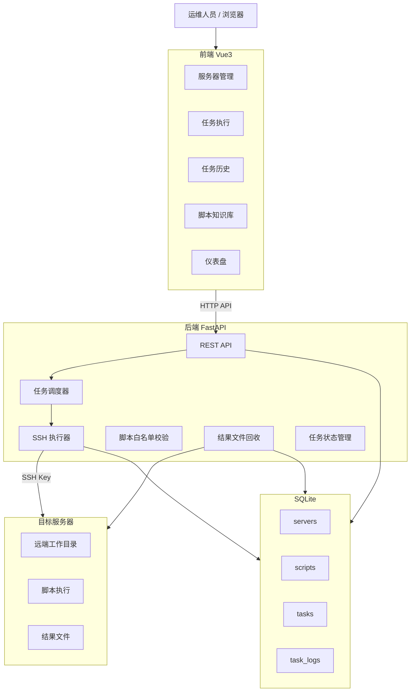
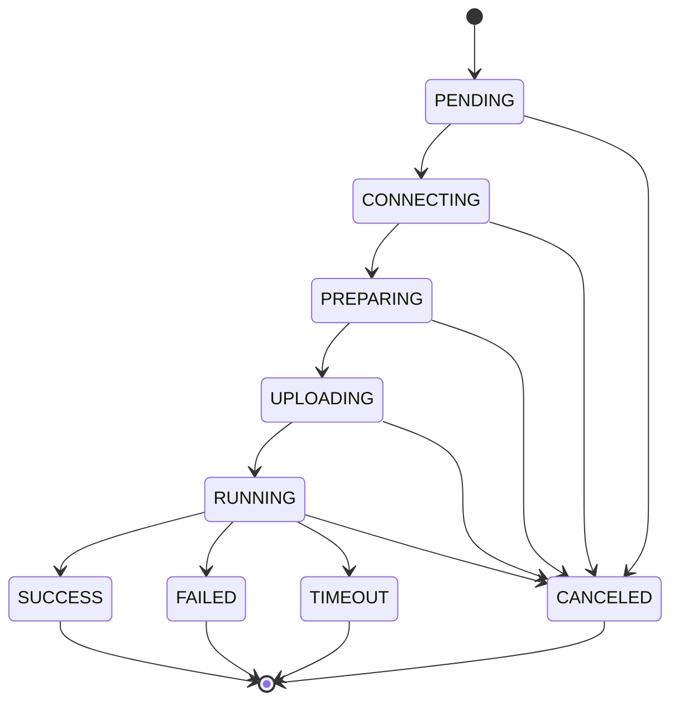

# HPCDeploy 系统架构说明

> 本文档描述 HPCDeploy 当前实际系统架构，非设计阶段草案。

---

## 1. 系统定位

HPCDeploy 是一个面向 HPC 运维的轻量级脚本执行控制台。核心能力：

- 通过 Web 页面管理目标服务器
- 维护脚本知识库（四类固定目录）
- SSH/SFTP 远程执行白名单脚本
- 实时日志 HTTP 轮询 + 资源快照
- 任务历史与结果文件回收
- 任务删除（DELETE + cleanup 双接口，安全校验前置）
- 任务取消（PID→PGID 进程组终止 + 目录清理）

---

## 2. 技术栈

| 模块 | 技术 | 说明 |
|------|------|------|
| 前端框架 | Vue 3 + Vite | 后台管理控制台 |
| 前端 UI | Element Plus | 表格、表单、卡片、弹窗 |
| 前端请求 | Axios | REST API 调用 |
| 前端状态管理 | Pinia | 服务器/任务/日志状态 |
| 前端路由 | Vue Router | 页面路由 |
| 后端框架 | FastAPI | REST API |
| 后端运行 | Uvicorn | ASGI 服务 |
| ORM | SQLAlchemy | 数据库 ORM |
| 数据校验 | Pydantic | 请求/响应校验 |
| 数据库 | SQLite | 单文件数据库 |
| SSH 执行 | Paramiko | SSH Key 认证 + SFTP |
| 任务队列 | asyncio 内存协程 | 无持久化队列 |
| 部署方式 | systemd 服务 | 前后端独立服务 |

---

## 3. 总体架构



---

## 4. 核心模块

### 4.1 脚本知识库 (`backend/app/core/script_library.py`)

四类固定目录，由后端文件系统扫描驱动，不依赖数据库 scripts 表：

| 分类 | 目录 | 文件类型 | 执行行为 |
|------|------|----------|----------|
| 编译环境 | `backend/scripts/mpi/` | `.sh` | 白名单脚本执行 |
| 压测脚本 | `backend/scripts/stress/` | `.sh` | 直接执行，带时长参数 |
| 测试脚本 | `backend/scripts/test/` | `.sh` | 直接执行 |
| 容器文件 | `backend/apptainer/` | `.sif` | 仅上传分发，不执行 |

### 4.2 任务类型

| 类型 | 执行命令 | 远程目录 | 结果回收 | 说明 |
|------|----------|----------|----------|------|
| test | `bash ./script.sh` | `~/hpcdeploy/tasks/test/{id}/` | 否 | 测试脚本 |
| stress | `./script.sh duration_seconds` | `~/hpcdeploy/tasks/stress/{id}/` | 是 | 压测 + 资源快照 |
| mpi | `bash ./script.sh` | `~/hpcdeploy/tasks/mpi/{id}/` | 否 | 白名单3个脚本 |
| apptainer | SFTP 上传 `.sif` | `$HOME/hpcdeploy/apptainer/` | 否 | 不做 run/exec |

### 4.3 MPI 脚本白名单

`backend/scripts/mpi/` 下当前开放执行的脚本：

- `mpi_env_test.sh` — 环境检测
- `install_oneapi_2022.sh` — Intel OneAPI 安装
- `install_openmpi_4.1.6_aocc_aocl.sh` — OpenMPI 编译安装
- 其他 `.sh` 文件仅作知识库保留，不真实执行

### 4.4 任务状态机

状态流转：



终态（不再变化）：SUCCESS、FAILED、TIMEOUT、CANCELED

---

## 5. 远程目录设计

### 5.1 工作目录

```
~/hpcdeploy/tasks/{task_type}/{task_id}/
```

- `task_type`: test / stress / mpi
- `task_id`: 后端生成的唯一 ID
- 目录结构不包含 `/root/~/` 前缀（`_resolve_remote_work_dir` 使用 SSH 检测到的 `$HOME`）
- apptainer 类型使用独立目录：`$HOME/hpcdeploy/apptainer/`

### 5.2 文件权限

- `.sh` / `.py` 上传后 `chmod +x` → `-rwxr-xr-x`
- `.sif` 不上传可执行权限

### 5.3 结果文件回收目录

```
backend/data/artifacts/{task_id}/
```

允许回收的后缀：`.log`、`.txt`、`.csv`、`.xlsx`、`.json`
禁止回收：`.sh`、`.py`、`.sif`、隐藏文件、目录、软链接

---

## 6. 任务取消设计

### 6.1 进程模型

执行时使用 `setsid --wait` 创建新 session：

```bash
setsid --wait bash -lc 'printf "%s" $$ > .hpcdeploy.pid; exec <command>'
```

- `setsid` 创建新 session（pid == pgid）
- PID 写入 `.hpcdeploy.pid` 文件
- `exec` 后 bash PID 变为脚本 PID

### 6.2 取消流程

```
任务取消请求
  ↓
读取远程 .hpcdeploy.pid → 获取 PID
  ↓
通过 ps -o pgid= 或 /proc/<pid>/stat 获取 PGID
  ↓
SIGTERM → 等待 5s → SIGKILL
  ↓
清理远端工作目录（rm -rf）
  ↓
清理临时目录白名单（如 /tmp/oneapi_install_2022）
  ↓
任务状态 → CANCELED, exit_code → -15
```

### 6.3 安全模型

- 不许前端传 PID/路径/命令
- PID 文件路径即授权校验（路径验证通过才读）
- 临时目录白名单：后端代码级硬编码，非数据库配置
- 取消失败（如 SSH 断开）不改变 CANCELED 状态
- 不会删除任务记录、任务日志
- 不会回滚已安装到 `/opt`、`/usr` 的软件

### 6.4 临时目录白名单

| 脚本 | 临时目录 |
|------|----------|
| `install_oneapi_2022.sh` | `/tmp/oneapi_install_2022` |
| `install_openmpi_4.1.6_aocc_aocl.sh` | `/tmp/openmpi_aocc_aocl_install` |

---

## 7. 安全边界

### 7.1 前端不可传入

- `command` → 命令由后端按任务类型固定生成
- `remote_path` → 路径由后端按规则计算
- `timeout` → 由后端根据任务类型计算
- PID/进程组信息 → 取消通过 PID 文件定位

### 7.2 后端校验

- 脚本路径必须命中知识库目录
- 文件名校验（`basename`、禁止 `..`、禁止 `/`）
- 文件路径 `resolve()` + `startswith()` 防逃逸
- 回收文件后缀白名单

### 7.3 远端安全

- 远端工作目录 `$HOME/hpcdeploy/` 下
- `_resolve_remote_work_dir` 禁止 `/root`、`/home`、`/tmp`、`/opt`、`/usr`、`/etc` 等顶层目录
- 同服务器防重复提交（同一 server_id 只允许一个未完成任务）

---

## 8. 日志体系

### 8.1 日志层级

| Level | 来源 | 说明 |
|-------|------|------|
| SYSTEM | 后端生成 | 连接/上传/执行/状态变更/回收 |
| INFO | SSH stdout | 脚本正常输出 |
| ERROR | SSH stderr | 脚本错误输出 |

### 8.2 日志存储

- 每条日志写入 `task_logs` 表
- 时间戳存储为 UTC，前端 `formatDateTime()` 转换本地时间
- 显示格式：`YYYY/MM/DD HH:mm:ss`（本地时间）

### 8.3 实时查看

- 前端 1s HTTP 轮询 `GET /api/tasks/{id}/logs`
- 非 WebSocket
- 日志下载：`GET /api/tasks/{id}/logs/download` → text/plain

---

## 9. 关键设计决策

### 9.1 为什么不用 WebSocket？

- HTTP 轮询实现更简单，1s 间隔对 MVP 足够
- 避免了 WebSocket 重连、心跳、鉴权等复杂度
- 后续可按需升级

### 9.2 为什么不用 Server Lock？

- 简单的同服务器状态检查（查询是否存在未完成任务）即可满足 MVP 需求
- 避免了分布式锁的复杂度

### 9.3 为什么用 `setsid --wait`？

- 确保整个进程组在一个 session 内（pid == pgid）
- 支持通过 PGID 一次性终止所有子进程
- `.hpcdeploy.pid` 作为可验证的取消定位依据

### 9.4 为什么不用 scripts 表做白名单？

- 当前通过文件系统扫描 + 代码级文件名白名单实现
- 无需数据库维护，部署更简单
- 只需在代码中添加文件名即可开放新脚本

---

## 10. 服务部署

### 10.1 开发模式

```bash
# 后端
cd backend && uvicorn main:app --host 0.0.0.0 --port 8000 --reload

# 前端
cd frontend && npm run dev -- --host 0.0.0.0 --port 5173
```

### 10.2 生产模式（systemd）

- `hpcdeploy-backend.service` → `ExecStart: uvicorn main:app`
- `hpcdeploy-frontend.service` → `ExecStart: npm run dev`
- 前端服务需要 `Environment=PATH=` 包含 nvm node 路径
- 数据库：`backend/data/hpc_control_panel.db` (SQLite)
- SSH 私钥：`backend/keys/` 目录，权限 `chmod 600`

---

## 11. 任务删除设计

### 11.1 双接口模型

| 接口 | 用途 | 删除内容 |
|------|------|----------|
| `POST /api/tasks/{task_id}/cleanup` | 仅清理文件 | 本地 artifacts + 远端工作目录 |
| `DELETE /api/tasks/{task_id}` | 完整删除 | 本地 artifacts + 远端工作目录 + task_logs + task 记录 |

- cleanup 保留任务记录和日志，适用于"只清理文件，保留执行记录"
- delete 完全移除任务，任务彻底从历史列表消失
- 两个接口均仅在任务为终态时可用（SUCCESS / FAILED / CANCELED）

### 11.2 删除流程

```
删除请求
  ↓
验证任务存在且为终态 → 否则 400
  ↓
删除本地 artifacts（shutil.rmtree）
  ↓
SSH 连接远端（失败 → 返回 502，不删数据库记录）
  ↓
验证远端工作目录安全格式（_is_safe_remote_work_dir → 失败 → 返回 400，不删数据库记录）
  ↓
rm -rf 远端工作目录
  ↓
验证删除结果
  ↓
删除 task_logs 记录
  ↓
删除 task 记录
  ↓
返回 TaskDeleteResponse
```

### 11.3 安全模型

- **远端路径安全校验**：`_is_safe_remote_work_dir()` 要求路径包含 `hpcdeploy/tasks/{type}/{timestamp}` 格式（至少 4 段），禁止 `/root`、`/home`、`/tmp`、`/opt`、`/usr`、`/etc`、`/`、`..`
- **本地路径防逃逸**：`resolve()` + `startswith()` 确保 artifact 目录在 `backend/data/artifacts/{task_id}/` 内
- **事务安全**：如果 SSH 连接失败或远端路径安全校验失败，返回错误且不删除数据库记录
- **不删除范围**：服务器配置、脚本知识库文件、已安装到 `/opt`/`/usr` 的软件、Apptainer 容器仓库、其他任务记录

### 11.4 与任务取消的区别

| 维度 | 取消 (Cancel) | 删除 (Delete) |
|------|---------------|---------------|
| 状态要求 | 仅未完成任务（RUNNING/PENDING等） | 仅终态任务（SUCCESS/FAILED/CANCELED） |
| 远端进程 | 终止进程组（SIGTERM/SIGKILL） | 无进程（任务已结束） |
| 远端目录 | 清理 | 清理 |
| 本地 artifacts | 不清理（任务未结束） | 清理 |
| 任务记录 | 保留，状态变为 CANCELED | 删除 |
| 任务日志 | 保留 | 删除 |
| 已安装软件 | 不回滚 | 不涉及 |
